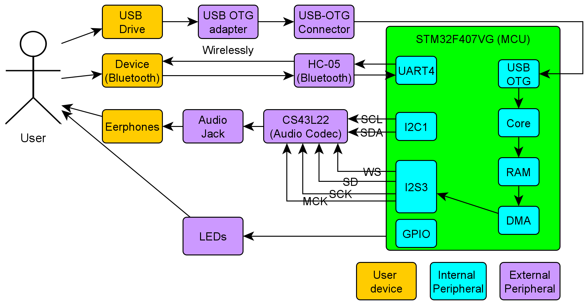
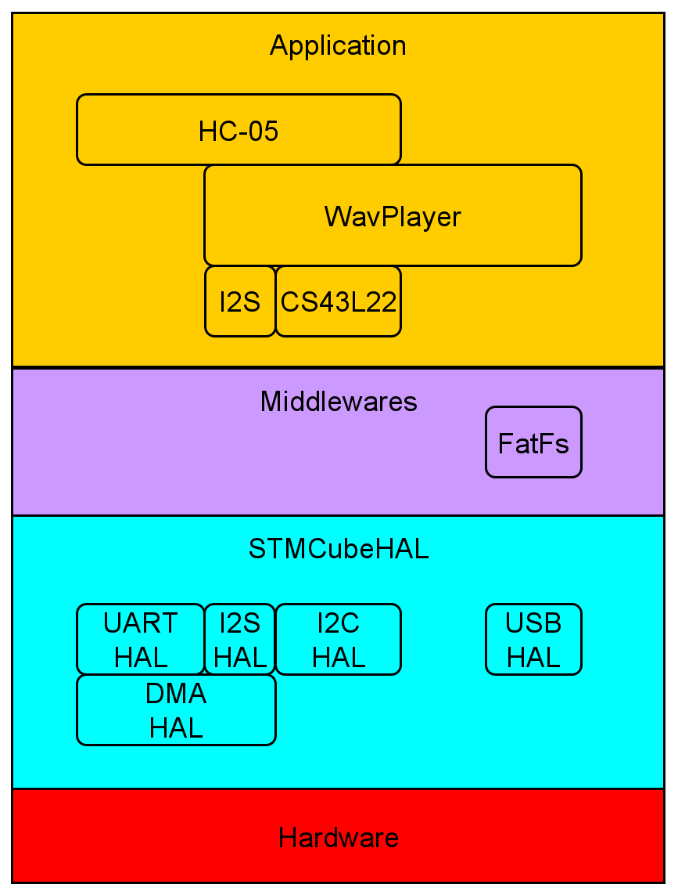
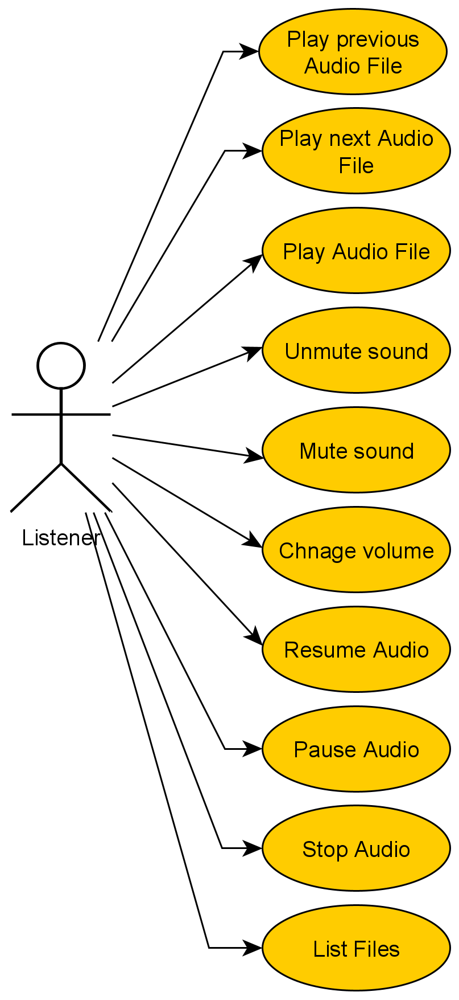
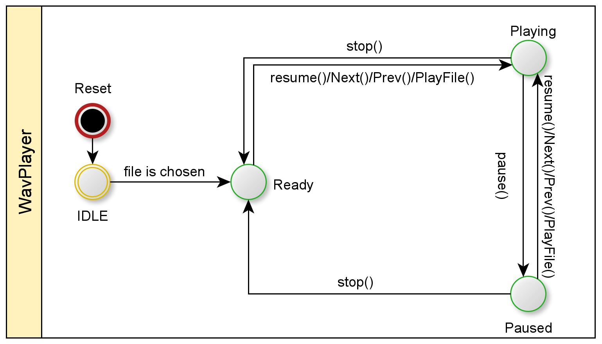
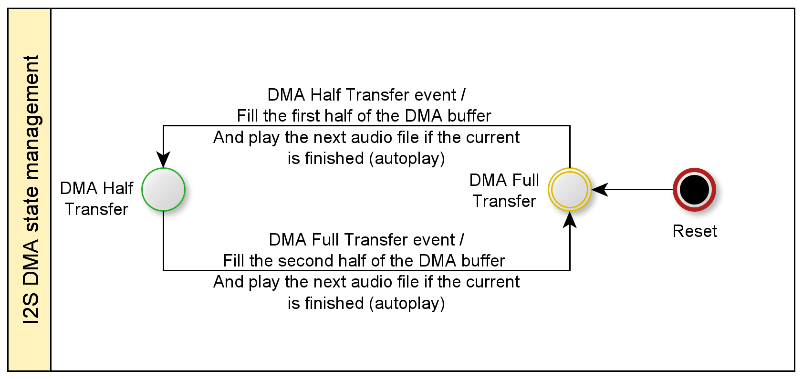
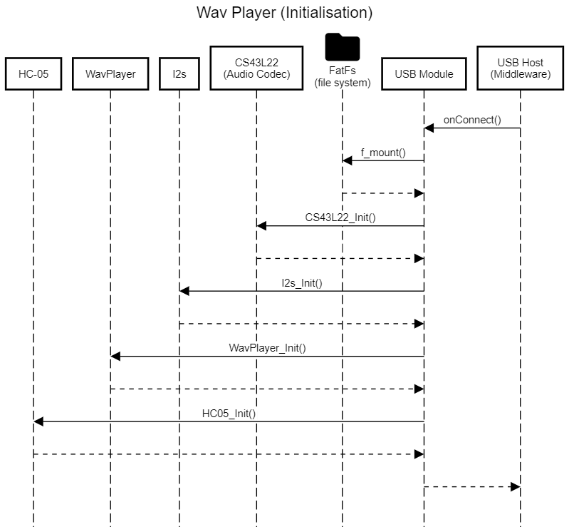
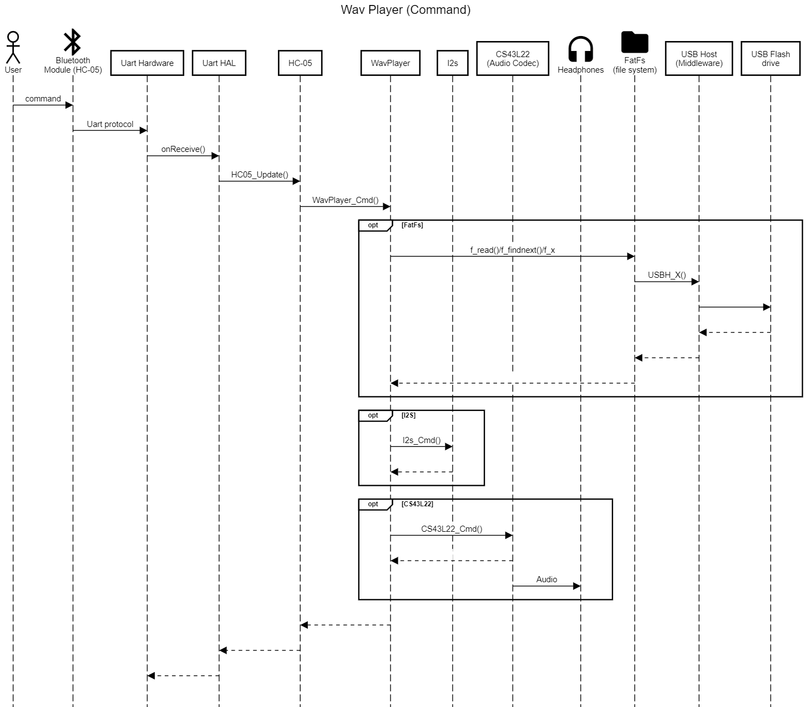

# About

WAV player, giving some audio files in WAV format on a USB drive, audio is played on earphone speakers with all possible sampling rates. The player can be controlled using Bluetooth class 4.

# Software Modules

## STM32F407VG (MCU)

This microcontroller is made by ST company, it has ARM cortex-M4 CPU. It’s responsible for handling the
user inputs through Bluetooth, interfacing with all peripherals, handling all necessary state machines.

## HC-05 Bluetooth module

It’s used as communication protocol between the user device and the embedded system, so that the
user can send commands. The error messages (not found file, bad volume value, etc.) are sent through
it.

## CS43L22 Audio Codec

This device is responsible for the converting from digital to analog, so that the user can hear the audio
file through the earphones. It uses I2C protocol for configuration and I2S protocol for receiving the audio
samples. It uses DAC of type Sigma Delta which is very accurate type.

## I2S peripheral

The audio samples are transmitted to an Audio Codec (to be explained later) using I2S (Inter-IC Sound,
eye-squared-ess) protocol. I2S protocol is made by Phillips like the I2C protocol. Its format is so close to
I2C format.

## I2C peripheral

I2C is used to interface with the Audio codec, so that it can control its functionalities like setting volume,
mute, unmute, etc.

## UART peripheral

It’s used to interface with the Bluetooth module.

## LEDs

It’s used to inform users of any important notifications. Green Led : File system is successfully mounted.

## DMA (Direct Memory Access)

It’s used to load the audio samples from memory to I2S data register using circular buffer. In this way, CPU can do any other job while the DMA takes care of transferring Audio samples to I2S. The CPU job is to just fill in the DMA buffer every time the buffer is fully/half fully read by DMA. The size of the DMA is chosen Arbitrary but we should care that’s not so small otherwise the DMA is useless, or too large otherwise we take much memory space from RAM.

## Usecases

## Finite State Machines (FSMs)

## Sequence Diagrams

# How to use the software

- You should have `STMCubeIDE`.
- Import the project in the `src` folder.
- Build and flash to your controller.
